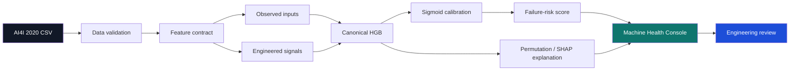
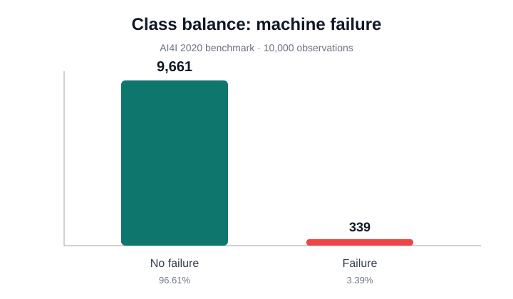
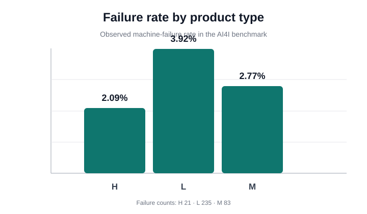
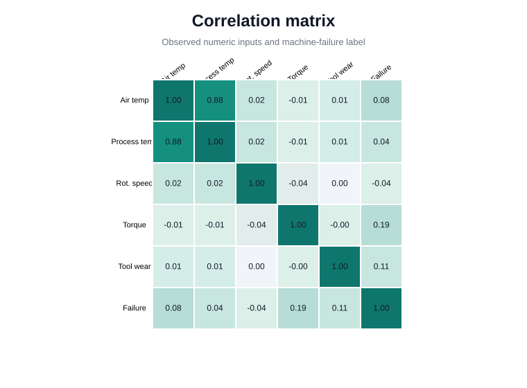

# AERIS — Machine Health Intelligence

[](https://github.com/sanketnichit/aeris-machine-health-intelligence/actions/workflows/ci.yml)

**Explainable fault detection and calibrated failure-risk scoring for industrial equipment.**

**Quick links:** [Model Card](docs/model_card.md) · [Engineering Decisions](docs/engineering_decisions.md) · [Reproducibility Audit](docs/reproducibility_audit.md) · [90-Second Demo](docs/demo_script.md) · [Runbook](RUNBOOK.md) · [Extended Validation](extended-validation/README.md)

> AERIS is designed first as a small, auditable predictive-maintenance system. Portfolio presentation is secondary to getting the engineering and evaluation right.

AERIS is a focused predictive-maintenance project built around the **AI4I 2020 Predictive Maintenance Dataset**. The project deliberately prioritizes a trustworthy end-to-end workflow over a large collection of loosely validated features.

## At a glance

| Area | AERIS v1 |
|---|---|
| Dataset | AI4I 2020 Predictive Maintenance (UCI) |
| Problem | Binary machine-failure detection |
| Risk layer | Sigmoid-calibrated HistGradientBoosting |
| Primary metric | PR-AUC / average precision |
| Explainability | Permutation importance + SHAP |
| Console | Streamlit Machine Health Console |
| Secondary validation | Failure-mode attribution, uncertainty, calibration and sensitivity studies |
| Reproducibility | Pinned dependencies + documented validation |

## Verified benchmark result

Primary seed-42 held-out risk-model result:

- **PR-AUC: 0.899**
- **Precision @ 0.50: 0.965**
- **Recall @ 0.50: 0.809**
- **F1 @ 0.50: 0.880**
- **Brier score: 0.0075**

Held-out confusion at the 0.50 threshold: **55 TP, 2 FP, 13 FN, 1,930 TN**.

95% stratified bootstrap intervals:

| Metric | 95% interval |
|---|---|
| PR-AUC | [0.835, 0.953] |
| Precision | [0.915, 1.000] |
| Recall | [0.721, 0.897] |
| F1 | [0.817, 0.938] |
| Brier | [0.0050, 0.0102] |

Across five fixed-model stratified splits, mean PR-AUC is **0.881 ± 0.025** and mean F1 is **0.836 ± 0.057** at the 0.50 calibrated threshold.

> These are benchmark measurements on synthetic AI4I data, not estimates of production fleet performance.

## Reviewer fast path

For a quick technical review:

1. **Start here:** this section for the held-out result and uncertainty context.
2. **Architecture:** read `docs/engineering_decisions.md` and the architecture diagram below.
3. **Implementation:** inspect `src/models.py`, `src/features.py`, and `src/console_models.py`.
4. **Evidence:** read `reports/risk_model.md` and `reports/explainability.md`.
5. **Demo:** run `streamlit run app.py` and use `docs/demo_script.md`.
6. **Reproducibility:** finish with `docs/reproducibility_audit.md`.
7. **Deep dive:** use `extended-validation/` for robustness studies.

## Project scope

### Core v1
1. **Fault detection** — classify whether a machine observation indicates failure.
2. **Risk scoring + explanation** — produce a calibrated failure-risk score and explain the model response.
3. **Engineering visualization** — a compact Machine Health Console for inspecting risk, predicted state and contributing factors.

The console also contains a **secondary HDF/PWF/OSF attribution panel**. Its feasibility study is kept in the extended-validation area because the attribution task is supplemental to the main detection-and-risk workflow.

### Explicitly out of scope for v1
- Remaining-useful-life (RUL) modelling
- What-if / counterfactual simulation
- LLM-generated engineering reports
- Streaming/Kafka deployment
- C-MAPSS temporal modelling
- Motorsport/FastF1 domain transfer

These are future extensions only. AERIS does not claim to use proprietary Red Bull/F1 telemetry.

## Dataset

**AI4I 2020 Predictive Maintenance Dataset**  
UCI Machine Learning Repository, dataset ID 601.

Source: https://doi.org/10.24432/C5HS5C  
License: CC BY 4.0

The dataset contains 10,000 machine observations with process variables, product type, a machine-failure target, and failure-mode indicators. The raw CSV is intentionally not committed; place it at `data/ai4i2020.csv` before running the pipeline.

## Why AI4I instead of C-MAPSS?

C-MAPSS is better suited to temporal degradation and RUL work, but it introduces substantially more sequence-processing and evaluation complexity. AERIS uses AI4I for v1 so the project can establish a clean detection → risk scoring → explanation workflow first.

C-MAPSS/RUL is reserved for future work. AI4I is synthetic, so the reported results are a controlled benchmark rather than evidence about a real machine fleet.

## Data validation

Before modelling, the dataset is checked for:

- missing values
- duplicates
- schema/type consistency
- physically invalid ranges
- target/flag consistency
- class imbalance

Current validation found **3.39% positive machine-failure labels**, so precision, recall and PR-AUC are prioritized over raw accuracy.

A documented target/flag inconsistency exists in 27 rows; AERIS reports this rather than silently rewriting source labels.

## Feature design

AERIS uses six observed operating signals plus two deterministic engineering-derived features:

- `temp_delta_k` = process temperature − air temperature
- `mechanical_power_kw` = rotational speed × torque / 9549.2966

These transformations use only observed inputs. They do not use machine-failure or failure-mode labels.

Under the fixed benchmark evaluation, the engineered features improve ranking and thresholded detection. The project treats that as a benchmark result, not physical causality.

## Architecture



The offline evaluation and Streamlit console share the same feature contract and canonical model builders. The console implementation lives in `src/console_models.py`; it does not maintain a separate UI-only risk model.

## Repository structure

```
aeris-machine-health-intelligence/
├── app.py
├── requirements.txt
├── LICENSE
├── DATA_LICENSE.md
├── RUNBOOK.md
├── .github/workflows/ci.yml
├── data/
│   └── README.md
├── src/
│   ├── load_data.py
│   ├── features.py
│   ├── validate_data.py
│   ├── eda.py
│   ├── train_baseline.py
│   ├── risk_model.py
│   ├── explain_model.py
│   ├── models.py
│   ├── console_models.py
│   └── __init__.py
├── reports/
│   ├── data_validation.md
│   ├── dataset_decision.md
│   ├── baseline_metrics.md
│   ├── risk_model.md
│   └── explainability.md
├── docs/
│   ├── engineering_decisions.md
│   ├── model_card.md
│   ├── demo_script.md
│   └── reproducibility_audit.md
├── extended-validation/
│   ├── README.md
│   ├── src/
│   └── reports/
├── figures/
└── tests/
```

The extended-validation directory contains additional robustness and study code that supports the project without making the minimum v1 pipeline look larger than it is.


## Visual data checks

A few compact EDA views are committed alongside the reports:







These figures are descriptive checks on the synthetic AI4I benchmark; they are not production-fleet evidence.

## Current status

### Core
- [x] Dataset loading and schema normalization
- [x] Data validation and class-balance analysis
- [x] Exploratory data analysis
- [x] Binary baseline
- [x] Canonical HistGradientBoosting risk model
- [x] Raw-vs-engineered feature contract
- [x] Sigmoid probability calibration
- [x] Permutation importance + SHAP
- [x] Machine Health Console
- [x] Model, data, feature and runtime tests
- [x] Reproducibility documentation

### Extended validation
- [x] Model-family comparison
- [x] OOF threshold study
- [x] Bootstrap uncertainty intervals
- [x] Split sensitivity
- [x] Held-out error analysis
- [x] Feature-importance stability
- [x] Subgroup calibration
- [x] Failure-mode feasibility
- [x] Feature ablation

## Evaluation discipline

The primary evaluation uses one stratified 80/20 seed-42 train/test split.

Model selection uses 5-fold stratified cross-validation on the training partition. The final test partition is not used to tune the model.

The extended validation studies are downstream checks. They do not change the primary held-out result.

## Running the core pipeline

From the repository root:

```bash
pip install -r requirements.txt
python src/validate_data.py
python src/eda.py
python src/train_baseline.py
python src/risk_model.py
python src/explain_model.py
pytest -q
```

The raw benchmark CSV must be present at `data/ai4i2020.csv`.

### Run the optional extended validation

```bash
python extended-validation/src/model_comparison.py
python extended-validation/src/feature_ablation.py
python extended-validation/src/evaluate_thresholds.py
python extended-validation/src/uncertainty_audit.py
python extended-validation/src/split_sensitivity.py
python extended-validation/src/error_analysis.py
python extended-validation/src/feature_stability.py
python extended-validation/src/calibration_audit.py
python extended-validation/src/failure_mode_attribution.py
```

See `extended-validation/README.md` for the purpose of each study.

### Run the engineering console

```bash
streamlit run app.py
```

The console trains its inference bundle through `src/console_models.py`, reusing the canonical calibrated HGB and model-specific explanation/mode builders.

## Future work

- real industrial time-series validation
- NASA C-MAPSS run-to-failure / RUL extension
- temporal degradation modelling
- counterfactual what-if analysis
- streaming telemetry
- deployment and monitoring
- FastF1/motorsport-domain adaptation

## Disclaimer

AERIS is an educational/portfolio project using public benchmark data. It is not a production maintenance system and does not represent Red Bull Powertrains systems, models, telemetry or engineering decisions.
