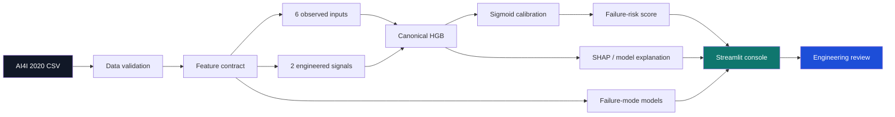

# AERIS — Machine Health Intelligence

[](https://github.com/sanketnichit/aeris-machine-health-intelligence/actions/workflows/ci.yml)

**Explainable fault detection and calibrated failure-risk scoring for industrial equipment.**

**Quick links:** [Model Card](docs/model_card.md) · [Engineering Decisions](docs/engineering_decisions.md) · [Reproducibility Audit](docs/reproducibility_audit.md) · [90-Second Demo](docs/demo_script.md) · [Interview Walkthrough](docs/interview_walkthrough.md) · [Resume Bullets](docs/resume_bullets.md) · [Runbook](RUNBOOK.md)

> **Portfolio focus:** a deliberately small predictive-maintenance system built to be auditable, reproducible and honest about uncertainty.

AERIS is a focused predictive-maintenance project built around the **AI4I 2020 Predictive Maintenance Dataset**. The project intentionally prioritizes a small, auditable end-to-end ML pipeline over a large collection of loosely validated features.

## At a glance

| Area | AERIS v1 |
|---|---|
| Dataset | AI4I 2020 Predictive Maintenance (UCI) |
| Problem | Binary machine-failure detection |
| Risk layer | Sigmoid-calibrated HistGradientBoosting |
| Primary metric | PR-AUC / average precision |
| Explainability | Permutation importance + SHAP |
| Secondary layer | HDF / PWF / OSF mode attribution |
| Evaluation | Stratified 80/20 holdout + 5-fold training CV |
| Robustness | Bootstrap, split sensitivity, calibration, error and feature-stability audits |
| UI | Streamlit Machine Health Console |
| Reproducibility | Pinned dependencies + documented audit |

## Project scope

### Core
1. **Fault detection** — classify whether a machine observation indicates failure.
2. **Risk scoring + explanation** — produce a calibrated failure-risk score and explain the model response.
3. **One engineering visualization** — a compact Machine Health Console for inspecting risk, predicted state and contributing factors.
4. **Failure-mode attribution (secondary)** — expose HDF, PWF and OSF separately; TWF and RNF remain deferred because their benchmark signals are weak/unstable.

### Explicitly out of scope for v1
- Remaining-useful-life (RUL) modelling
- What-if / counterfactual simulation
- LLM-generated engineering reports
- Streaming/Kafka deployment
- C-MAPSS temporal modelling
- Motorsport/FastF1 domain transfer

These are documented as future extensions only. The project does not claim to use proprietary Red Bull/F1 telemetry.

## Dataset

**AI4I 2020 Predictive Maintenance Dataset**  
UCI Machine Learning Repository, dataset ID 601.

Source: https://doi.org/10.24432/C5HS5C  
License: CC BY 4.0

The dataset contains 10,000 machine observations with process variables, product type, a machine-failure target, and failure-mode indicators. The raw CSV is kept outside the repository's first commit; place it under `data/ai4i2020.csv` before running the scripts.

## Why AI4I instead of C-MAPSS?

C-MAPSS is stronger for temporal degradation and RUL work, but it introduces substantially more sequence-processing and evaluation complexity. AERIS uses AI4I for v1 so the project can establish a trustworthy detection → risk scoring → explanation workflow first.

C-MAPSS/RUL is deliberately reserved for future work. AI4I is synthetic, so its results are a controlled benchmark, not evidence about a real machine fleet.

## Data validation

Before modelling, the dataset is checked for:

- missing values
- duplicates
- schema/type consistency
- physically invalid ranges
- target/flag consistency
- class imbalance

Current validation found **3.39% positive machine-failure labels**, making this an imbalanced classification problem. Precision, recall and PR-AUC are therefore prioritized over raw accuracy.

A documented target/flag inconsistency exists in 27 rows; AERIS reports this instead of silently rewriting the source labels.

## Feature design

AERIS uses six observed operating signals plus two deterministic engineering-derived features:

- `temp_delta_k` = process temperature − air temperature
- `mechanical_power_kw` = torque × rotational speed / 9549.2966

These transformations use only observed inputs. They do not use machine-failure or failure-mode labels.

The derived features materially improve the AI4I benchmark results, but the project treats that improvement cautiously because synthetic datasets can encode structured relationships between inputs and labels.

## Architecture



The important architectural rule is that the **offline evaluation and Streamlit console share the same feature contract and model builders**. The console implementation lives in `src/console_models.py`; it does not maintain a separate UI-only model definition.

## Repository structure

```
aeris-machine-health-intelligence/
├── app.py
├── requirements.txt
├── LICENSE
├── DATA_LICENSE.md
├── RUNBOOK.md
├── .github/workflows/ci.yml
├── data/
│   └── README.md
├── src/
│   ├── __init__.py
│   ├── load_data.py
│   ├── features.py
│   ├── validate_data.py
│   ├── eda.py
│   ├── train_baseline.py
│   ├── model_comparison.py
│   ├── risk_model.py
│   ├── failure_mode_attribution.py
│   ├── explain_model.py
│   ├── evaluate_thresholds.py
│   ├── uncertainty_audit.py
│   ├── split_sensitivity.py
│   ├── error_analysis.py
│   ├── feature_stability.py
│   ├── calibration_audit.py
│   ├── feature_ablation.py
│   ├── models.py
│   └── console_models.py
├── reports/
│   ├── data_validation.md
│   ├── model_comparison.md
│   ├── risk_model.md
│   ├── threshold_analysis.md
│   ├── failure_mode_attribution.md
│   ├── explainability.md
│   ├── subgroup_audit.md
│   ├── uncertainty_audit.md
│   ├── split_sensitivity.md
│   ├── error_analysis.md
│   ├── feature_stability.md
│   ├── calibration_audit.md
│   └── feature_ablation.md
├── docs/
│   ├── engineering_decisions.md
│   ├── model_card.md
│   ├── demo_script.md
│   └── reproducibility_audit.md
├── figures/
└── tests/
    ├── test_data_contract.py
    ├── test_features.py
    ├── test_model_smoke.py
    ├── test_models.py
    └── test_console_models.py
```

## Reviewer quick path

A technical reviewer can follow the project in this order:

1. `README.md` — scope, architecture and headline results.
2. `docs/engineering_decisions.md` — why the design choices were made.
3. `reports/risk_model.md` — primary evaluation and calibration.
4. `reports/feature_ablation.md` — evidence for the engineered features.
5. `reports/uncertainty_audit.md` and `reports/split_sensitivity.md` — robustness.
6. `app.py` + `docs/demo_script.md` — live console and demonstration path.
7. `docs/reproducibility_audit.md` — reproduction record.\n8. `docs/interview_walkthrough.md` + `docs/resume_bullets.md` — application-ready project framing.

## Current status

- [x] Dataset loaded and schema-normalized
- [x] Data validation
- [x] Class-balance analysis
- [x] Exploratory data analysis
- [x] Binary Random Forest baseline
- [x] 3-model comparison with held-out test set
- [x] Engineering-derived feature evaluation
- [x] Raw-vs-engineered feature ablation
- [x] HistGradientBoosting selected for v1
- [x] Sigmoid-calibrated risk model
- [x] Failure-mode feasibility analysis
- [x] Permutation importance + SHAP explanations
- [x] Machine Health Console
- [x] Threshold/calibration analysis
- [x] Product-type subgroup audit
- [x] Stratified bootstrap uncertainty audit
- [x] Fixed-model split-sensitivity audit
- [x] Held-out error analysis
- [x] Feature-importance stability audit
- [x] Subgroup/risk-bin calibration audit
- [x] Model pipeline smoke test
- [x] Shared model-architecture contract tests
- [x] Reproducibility audit + pinned direct dependencies
- [x] Engineering-feature unit test
- [x] Data-contract tests + CI
- [x] Shared console model bundle + runtime test

## Evaluation discipline

The primary evaluation uses one stratified 80/20 seed-42 train/test split.

Model selection uses 5-fold stratified cross-validation on the training partition. The final test partition is not used to tune the model.

Secondary audits are deliberately downstream robustness checks:
- bootstrap intervals quantify sampling uncertainty around the seed-42 test metrics
- five alternate stratified splits measure sensitivity to the test partition
- calibration audits inspect risk behaviour by subgroup and operating regime
- feature-stability audits measure whether importance rankings persist across splits
- error analysis remains descriptive and does not trigger hidden threshold tuning

## Running the current pipeline

From the repository root:

```bash
pip install -r requirements.txt
python src/validate_data.py
python src/eda.py
python src/model_comparison.py
python src/risk_model.py
python src/failure_mode_attribution.py
python src/explain_model.py
python src/evaluate_thresholds.py
python src/uncertainty_audit.py
python src/split_sensitivity.py
python src/error_analysis.py
python src/feature_stability.py
python src/calibration_audit.py
python src/feature_ablation.py
pytest -q
```

The threshold evaluation writes the calibration and precision-recall plots to `figures/`.

### Run the engineering console

```bash
streamlit run app.py
```

The console trains its inference bundle through `src/console_models.py`, which reuses the canonical calibrated HGB, explanation-tree and failure-mode model builders. UI input limits follow the observed AI4I benchmark ranges.

## Current verified results

Primary seed-42 held-out risk-model result:

- **PR-AUC: 0.899**
- **Precision @ 0.50: 0.965**
- **Recall @ 0.50: 0.809**
- **F1 @ 0.50: 0.880**
- **Brier score: 0.0075**

The held-out error profile at the 0.50 threshold is **55 true positives, 2 false positives, 13 false negatives and 1,930 true negatives**.

The 95% stratified bootstrap intervals are:
- PR-AUC: **[0.835, 0.953]**
- Precision: **[0.915, 1.000]**
- Recall: **[0.721, 0.897]**
- F1: **[0.817, 0.938]**
- Brier: **[0.0050, 0.0102]**

Across five fixed-model stratified splits, mean PR-AUC is **0.881 ± 0.025** and mean F1 is **0.836 ± 0.057** at the 0.50 calibrated threshold.

The model comparison, feature ablation, threshold study, subgroup audit, explainability record, uncertainty audit, split-sensitivity audit, error analysis, feature-stability audit, and calibration audit are all retained in `reports/`.

See `docs/model_card.md` for intended use and limitations, `docs/engineering_decisions.md` for the reasoning record, and `docs/reproducibility_audit.md` for the numerical reproduction audit.

See `docs/demo_script.md` for the recruiter/interview demo.

## Future work

- real industrial time-series validation
- NASA C-MAPSS run-to-failure / RUL extension
- temporal degradation modelling
- counterfactual what-if analysis
- streaming telemetry
- deployment and monitoring
- FastF1/motorsport-domain adaptation

## Disclaimer

AERIS is an educational/portfolio project using public benchmark data. It is not a production maintenance system and does not represent Red Bull Powertrains systems, models, telemetry or engineering decisions.
